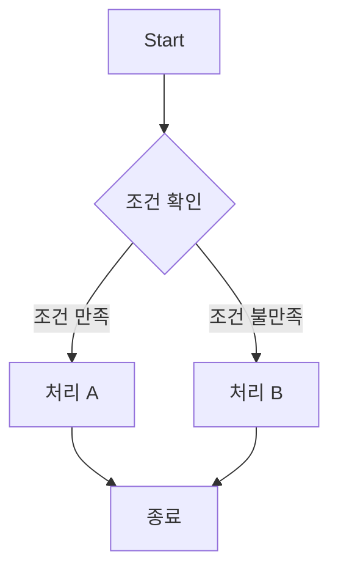

개발 문서나 기술 블로그를 작성할 때 다이어그램은 개념을 시각적으로 쉽게 이해할 수 있도록 돕는 중요한 요소다. 그런데 기존의 다이어그램 작성 도구는 이미지 파일로 다이어그램을 관리해야 하고, 수정할 때마다 번거롭다. 이 문제를 해결하기 위해 "Mermaid"라는 도구를 알게 되어 소개한다.

# Mermaid란?

Mermaid는 Markdown 파일 내에서 다이어그램을 코드로 작성할 수 있게 해주는 도구다. 복잡한 GUI 없이도 간단한 텍스트 코드로 여러 종류의 다이어그램을 그릴 수 있어 개발자에게 매우 유용하다. 특히 GitHub, GitLab 같은 플랫폼에서 지원되기 때문에 별도의 설치 없이도 다이어그램을 바로 확인할 수 있다.

# 장점

다이어그램을 텍스트 코드로 작성할 수 있다는 점이 가장 큰 장점이다. 코드 기반으로 다이어그램을 작성하면 버전 관리를 통해 이력을 남기거나 협업 시 수정 사항을 트래킹할 수 있다. 또한 텍스트로 표현되므로 파일 용량이 작고, 쉽게 수정할 수 있어 반복적으로 업데이트되는 프로젝트에 적합하다.

Mermaid는 다음과 같은 다이어그램을 지원한다:

- 플로우차트(Flowchart)
- 시퀀스 다이어그램(Sequence Diagram)
- 간트차트(Gantt Chart)
- 클래스 다이어그램(Class Diagram)
- 상태도(State Diagram)
- 파이 차트(Pie Chart)
- ER 다이어그램(Entity Relationship Diagram)

# 간단한 사용법

Mermaid 문법은 직관적이고 간단하다. 기본적인 플로우차트 예시를 보자.

위 코드를 작성하면, 다음과 같은 플로우차트가 그려진다:

  

- A에서 시작해 B에서 조건을 확인하고,
- 조건을 만족하면 C로, 그렇지 않으면 D로 이동한다.
- 최종적으로 C와 D는 E로 이어져 종료된다.

Mermaid의 큰 장점은 이렇게 간단한 텍스트 코드로도 직관적인 다이어그램을 만들 수 있다는 점이다.

# Mermaid 적용 방법

Mermaid를 적용하려면 기본적으로 다음과 같은 방식으로 접근할 수 있다:

- Markdown 파일 내에서 사용
  GitHub, GitLab 같은 플랫폼에서는 바로 지원된다. 코드블록 안에 mermaid를 선언한 후 다이어그램을 그리는 코드를 작성하면 된다.

- Mermaid Live Editor 사용
  공식 사이트의 Mermaid Live Editor에서 실시간으로 다이어그램을 작성하고 결과를 확인할 수 있다. 이 도구는 코드 작성 후 다이어그램을 바로 확인할 수 있어 유용하다.

- HTML 페이지에 직접 삽입
  웹 프로젝트에서 Mermaid.js 라이브러리를 로드하고, HTML 내에 
 태그와 Mermaid 코드를 삽입하여 다이어그램을 표시할 수 있다.

# 마무리

Mermaid는 Markdown을 활용해 빠르고 효율적으로 다이어그램을 그릴 수 있는 강력한 도구다. 협업과 버전 관리가 용이하며, 다양한 다이어그램을 지원해 프로젝트의 문서화에 큰 도움이 된다. 아직 사용해 보지 않았다면, Mermaid를 통해 더 나은 시각적 문서를 작성해보자.
